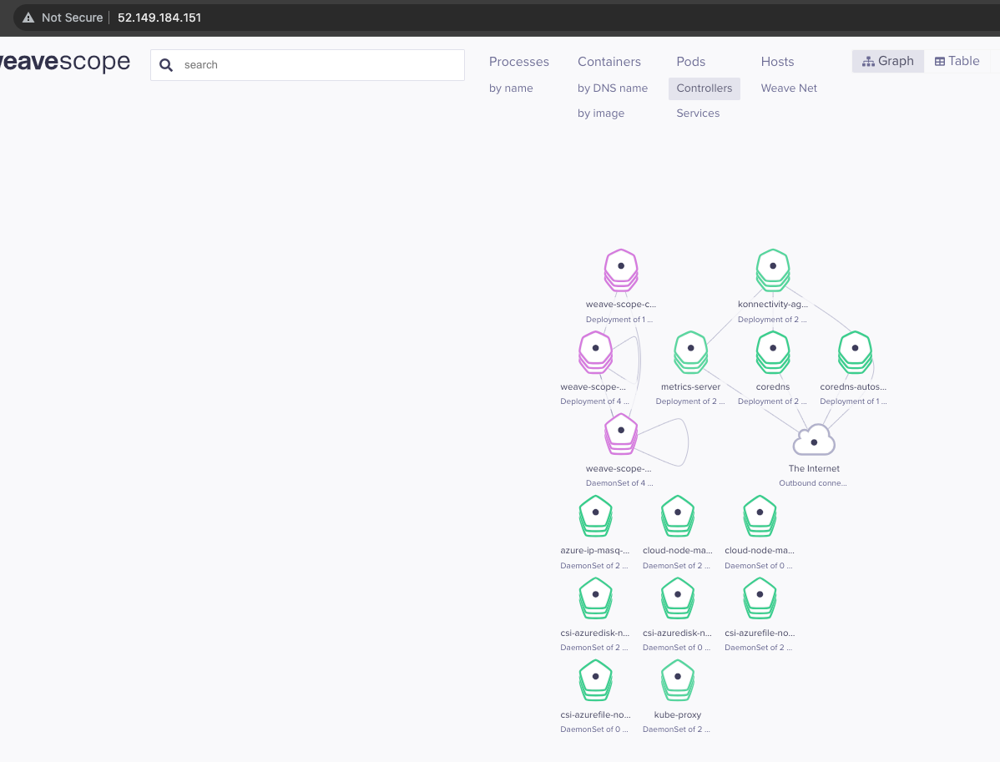
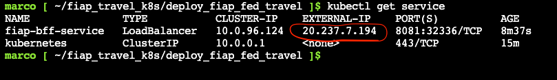
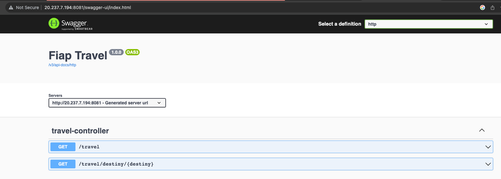
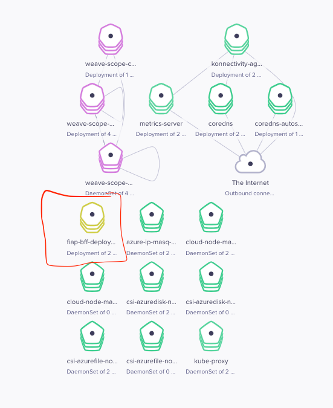
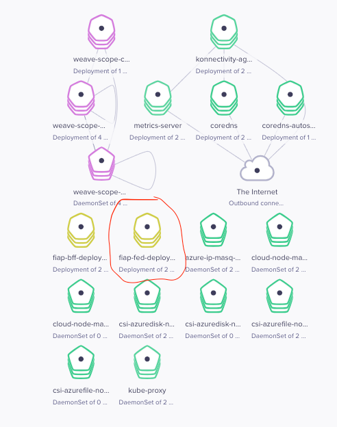

# FIAP TRAVEL

###### The target of this solution is show how to integrate a front-end with a back-end using the Microsfot Azure resources.
<br />


### 1. GET THE APPLICATIONS RESOURCES:
###### You will need the environment configuration files. 
###### These files contain all the deployment information necessary to set up the environment of the applications.

1. Download the set up files
```
git clone https://github.com/marcocouzin/fiap_travel_k8s.git
```


<br /><br /><br /><br /><br />


### 2. SET UP A CLUSTER AND A KUBERNETS
###### All the solution will run in a cluster with Kubernets
####  To install this solution, do:
1. Create a cluster using the Azure Cloud Shell
```
az group create --name gpakstravel --location eastus && az aks create --name akstravel --resource-group gpakstravel --node-count 2 --generate-ssh-keys
```
2. Connect to the cluster
```
az aks get-credentials --resource-group gpakstravel --name akstravel
```


<br /><br /><br /><br /><br />


### 3. ADMINISTRATIVE GRAPHIC TOOL 
###### An easy way to see what happening in your environment is using a tool called Weave Scope.
###### You just can install this tool if you have a Load Balancer Service running.
####  To install this tool, do:

1. Install the Weave Works graphic administration tool
```
kubectl apply -f https://github.com/weaveworks/scope/releases/download/v1.13.2/k8s-scope.yaml && kubectl patch svc weave-scope-app -n weave -p '{"spec": {"type": "LoadBalancer"}}'
```
2. Get the external IP to see the interface tool
```
kubectl get svc -n weave
```

3. Access the graphic interface
```
http://<external_ip>
```



<br /><br /><br /><br /><br />


### 4. DEPLOY THE BACK-END (BFF) SOLUTION:
###### This solution provide a back-end service for the front-end
####  To install this solution, do:
1. Access the folder that contain the deployment files of the back-end
```
cd ~/fiap_travel_k8s/deploy_fiap_bff_travel/
```
2. Create a deployment resource
```
kubectl create -f deploy_fiap_bff_travel_app.yml
```
3. Create a load balancer to expose the service
```
kubectl create -f deploy_fiap_bff_travel_loadbalancer.yml
```
4. Get the external IP that was created
```
kubectl get service
```

5. Try the solution. Open a browser and access the URL below:
```
http://<external_ip>:8081/swagger-ui/index.html
```

- OR check int the Weave Scope


6. Update the Back-end external IP in your environment variable for the front-end be able to access the back-end
```
https://www.mockable.io/
```


<br /><br /><br /><br /><br />


### 5. CREATING THE FRONT-END (FED) AZURE ENVIRONMENT:
###### This solution provide a front-end service
####  To install this solution, do:
1. Access the folder that contain the deployment files of the back-end
```
cd ~/fiap_travel_k8s/deploy_fiap_fed_travel/
```
4. Create a deployment resource
```
kubectl create -f deploy_fiap_fed_travel_app.yml
```
5. Create a load balancer to expose the service
```
kubectl create -f deploy_fiap_fed_travel_loadbalancer.yml
```
6. Get the external IP that was created
```
kubectl get service
```
--- evidence ---
7. Try the solution. Open a browser and access the URL below:
```
http://<external_ip>
```


- OR check in the Weave Scope




<br /><br /><br /><br /><br />


### 6. DESTROY ALL RESOURCES
####  To delete all resources, do:
```
az aks delete --yes --name akstravel --resource-group gpakstravel && az group delete --yes --resource-group gpakstravel && az group delete --yes --resource-group NetworkWatcherRG
```