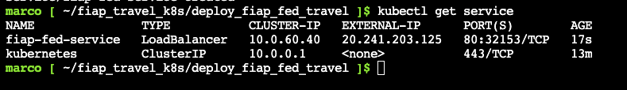
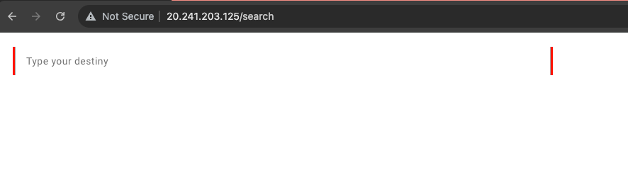

# FIAP TRAVEL


### CREATING THE BACK-END AZURE ENVIRONMENT:
1. Create a cluster using the Azure Cloud Shell
```
az group create --name gpaksbfftravel --location eastus && az aks create --name aksbfftravel --resource-group gpaksbfftravel --node-count 2 --generate-ssh-keys 
```
<br />

2. Connect to the cluster
```
az aks get-credentials --resource-group gpaksbfftravel --name aksbfftravel
```  
<br />

- Check the nodes
```
kubectl get nodes
```
```
kubectl get namespaces
```
```
kubectl get pod -A
```


<br /><br />
### SETTING UP THE APPLICATION ENVIRONMENT:

1. Download the set up files
```
git clone https://github.com/marcocouzin/fiap_travel_k8s.git
```
###### and then, run:
```
cd fiap_travel_k8s/deploy_fiap_bff_travel
```


2. Create a deployment resource
```
kubectl create -f deploy_fiap_bff_travel_app.yml 
```

3. Create a load balancer to expose the service
```
kubectl create -f deploy_fiap_bff_travel_loadbalancer.yml    
```

4. To destroy the environment, run:
```
az aks delete --yes --name aksbfftravel --resource-group gpaksbfftravel && az group delete --yes --resource-group gpaksbfftravel && az group delete --yes --resource-group NetworkWatcherRG
```


<br /><br />
### RUN THE APPLICATION
1. Get the external ip address
```
kubectl get service
```

2. Open a browser and access the application


<br/><br/>


<br /><br /><br />
### CREATING THE FRONT-END AZURE ENVIRONMENT:
1. Create a cluster using the Azure Cloud Shell
```
az group create --name gpaksfedtravel --location eastus && az aks create --name aksfedtravel --resource-group gpaksfedtravel --node-count 2 --generate-ssh-keys 
```

2. Connect to the cluster
```
az aks get-credentials --resource-group gpaksfedtravel --name aksfedtravel
```
- Check the nodes
```
kubectl get nodes
```
```
kubectl get namespaces
```
```
kubectl get pod -A
```

3. Run the Weave Works graphic administration tool
```
kubectl apply -f https://github.com/weaveworks/scope/releases/download/v1.13.2/k8s-scope.yaml && kubectl patch svc weave-scope-app -n weave -p '{"spec": {"type": "LoadBalancer"}}'
```

###### ! To check the installation and get the external IP, run: kubectl get svc -n weave
```
kubectl get svc -n weave
```
- Access the graphic tool
```
http://<external_ip>
```


<br /><br />
### SETTING UP THE APPLICATION ENVIRONMENT:

1. Download the set up files
```
git clone https://github.com/marcocouzin/fiap_travel_k8s.git
```
###### and then, run:

```
cd fiap_travel_k8s/deploy_fiap_fed_travel
```

2. Create a deployment resource
```
kubectl create -f deploy_fiap_fed_travel_app.yml 
```

3. Create a load balancer to expose the service
```
kubectl create -f deploy_fiap_fed_travel_loadbalancer.yml    
```

4. To destroy the environment, run:
```
az aks delete --yes --name aksfedtravel --resource-group gpaksfedtravel && az group delete --yes --resource-group gpaksfedtravel && az group delete --yes --resource-group NetworkWatcherRG
```

<br /><br />
### RUN THE APPLICATION
1. Get the external ip address
```
kubectl get service
```

2. Open a browser and access the application



<br/><br/>

### Helpful Commands
- Check the service
```    
kubectl get service
```

- List the deployment resources
```    
kubectl get deploy
```

- List the ReplicaSets resources
```    
kubectl get replicasets
```

- List the Pods resources
```    
kubectl get pods
```

- List the SVCs resources
```    
kubectl get svc
```